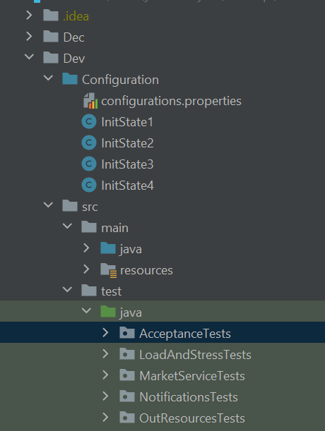

# Market

Yoad Ohayon - 323079103,
Yarin Peretz - 313577645,
Omer Shitrit - 208060210,
Lin Avraham - 316418391,
Barak Rapke - 315309666

## system startup:
    first make sure that your directories look as follows:


    Run the system in : Dev/src/main/java/Main.java
    To run the system with secured communication click on:
        https://localhost:555/
    Without secured communication click on:
        http://localhost:91/
    
    The system will check for available DB, and if so she will load the data from it.
    Otherwise, the user will choose a script to run.
   
   
   **_Script1_**
   
      1. Registered users: U1, U2, U3, U4
      2. Admins: Admin, U1
      3. Stores: s(id=0, founder=U2)
      4. Products: Bamba
      5. U3 has manager permission to s with inventory management ability
      
   **_Script2_**
   
      1. Registered users: U1, U2, U3
      2. Admins: Admin
      3. Stores: s1(id=0, founder=U1)
      
   **_Script3_**
   
      1. Registered users: U1, U2, U3
      2. Admins: Admin
      3. Stores: s1(id=0, founder=U1), s2(id=1, founder=U3)
      4. U2 has an owner permission to s1 by U1 appointment and s2 by U3 appointment
      5. U1 has an owner permission to s2 by U3 appointment
      
   **_Script4_**
   
      1. Registered users: U1, U2
      2. Admins: Admin
      3. Stores: s1(id=0, founder=U1)
      4. Admin cancelled U2 membership
      
   ## formats: 

    configuration file - resource bundle file which defines the parameters for the initialization of the system.
    the parameters should be the resources or services that the system will use during runtime.
    
   the configuration file can be edited on this file: [config properties](https://github.com/LinAvraham/Market/blob/main/Dev/Configuration/configurations.properties)  
   these are the fields that you can edit:  
   >1. system.admin.name - the system admin's username
   >2. system.admin.password - the system admin's password
   >3. port - the unsecured port for the system
   >4. sslPort - the secured port for the system
   >5. stateFileAddress - the address of the script file, the path should be like 🔴**Dev/Configuration/ScriptFileName.java**❗🔴 and you can locate your script file [here](https://github.com/LinAvraham/Market/blob/main/Dev/src/main/java/Configuration.java)
   >6. startupScript - the script file name, for example: if you added 🔴**Dev/Configuration/ScriptFileName.java**❗🔴 as state file you should sets this field to: 🔴**ScriptFileName**❗🔴
   >7. paymentAdapter - this field sets the external payment system that will work with the system, the payment system should follow this implementation
   ```java
   void connect();
   boolean pay(PaymentDetails data);
   void cancelPayment(PaymentDetails data);
   
   PaymentDetails contains: card number, month, year, holder, ccv, id, price
   ```
   >8. deliveryAdapter - this field sets the external delivery system that will work with the system, the delivery system should follow this implementation
   ```java
   void connect();
   boolean deliver(DeliveryDetails deliveryDetails);
   void cancelDelivery(DeliveryDetails deliveryDetails)
   
   DeliveryDetails contains: name, address, city, country, zip
   ```
   >9. persistence.unit - this field sets the persistance unit, with this parameter you can choose to which db to connect, according to do so you have to edit the file [persistance.xml](https://github.com/LinAvraham/Market/blob/main/Dev/src/main/resources/META-INF/persistence.xml), you should follow this to add a support of another persistence unit
```xml
<!-- Define a name used to get an entity manager. Define that you will
    complete transactions with the DB  -->
    <persistence-unit name="Market" transaction-type="RESOURCE_LOCAL">

        <!-- Define the class for Hibernate which implements JPA -->
        <provider>org.hibernate.jpa.HibernatePersistenceProvider</provider>
        <!-- Define the object that should be persisted in the database -->
        <!--        <class>store.Inventory</class>-->

        <properties>

            <!--     first time: use create-drop, to create DB, or update if DB already exist-->
            <!--            <property name="hibernate.hbm2ddl.auto" value="create-drop" />-->
            <property name="hibernate.hbm2ddl.auto" value="update" />


            <!-- Driver for DB database -->
            <property name="javax.persistence.jdbc.driver" value="com.mysql.cj.jdbc.Driver" />
            <!-- URL for DB -->
            <property name="javax.persistence.jdbc.url" value="jdbc:mysql://localhost:3306/mydb" />
            <!-- Username -->
            <property name="javax.persistence.jdbc.user" value="root" />
            <!-- Password -->
            <property name="javax.persistence.jdbc.password" value="1234" />
            <!-- Drop and re-create the database schema on startup -->

        </properties>
    </persistence-unit>
    
```
    
   <br><br>
   
    state file - java class that will be compiled during runtime
    the state file contains a series of instructions of use cases and arguments for them.
    the state file will be loaded and the system should be in that state after the initialization finished.
    
   the state file you create should follow the service of the system, the script instructions should be written using [these methods](https://github.com/omrigo13/TradingSystem/blob/main/Dev/src/main/java/service/TradingSystemService.java)
   
   ```java
   public class ScriptFileName {

    public static void run(Service marketService) throws Exception {
        code lines here...
        for example:
            String u1Conn = marketService.entrance();
            marketService.login(u1Conn, u1, password);
    }
}
```
